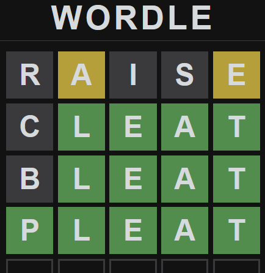
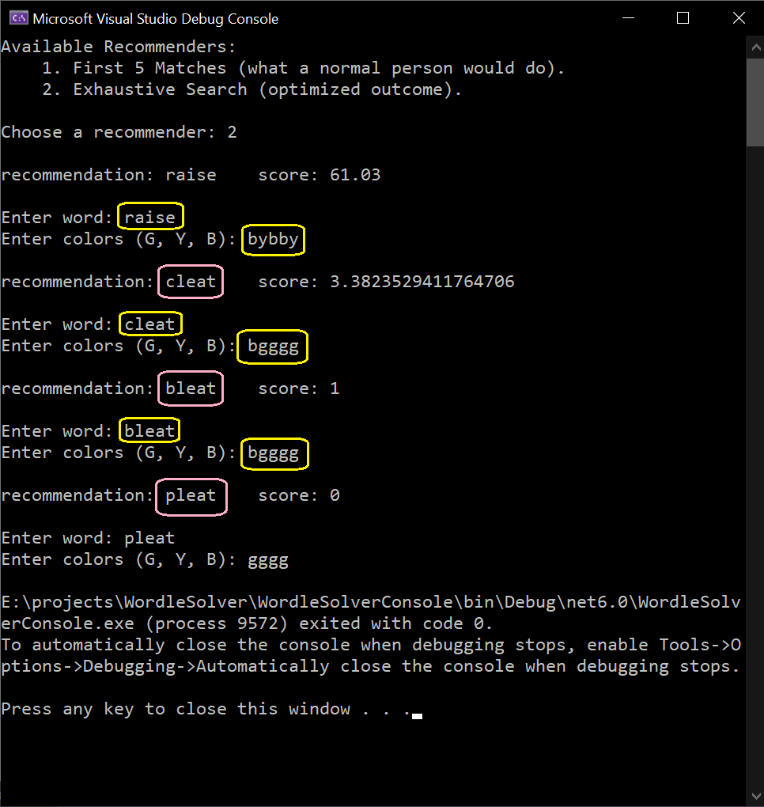
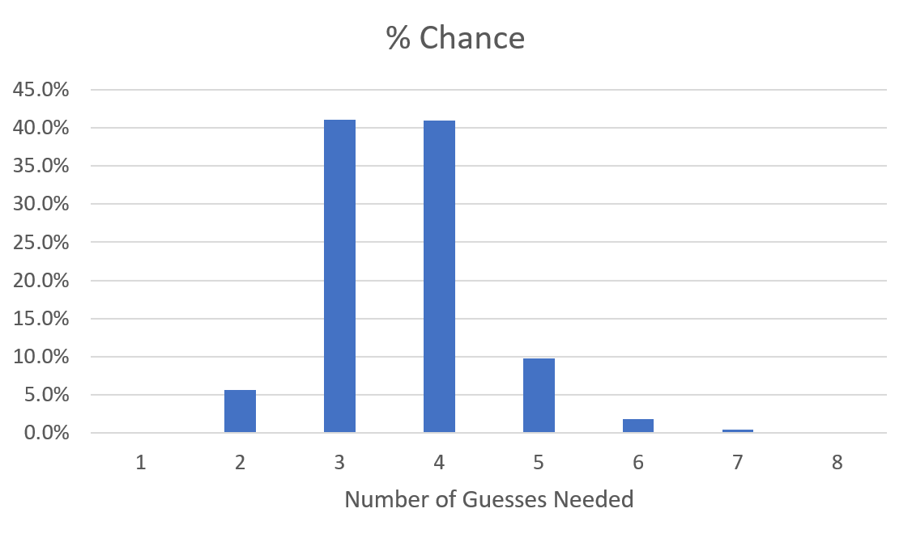
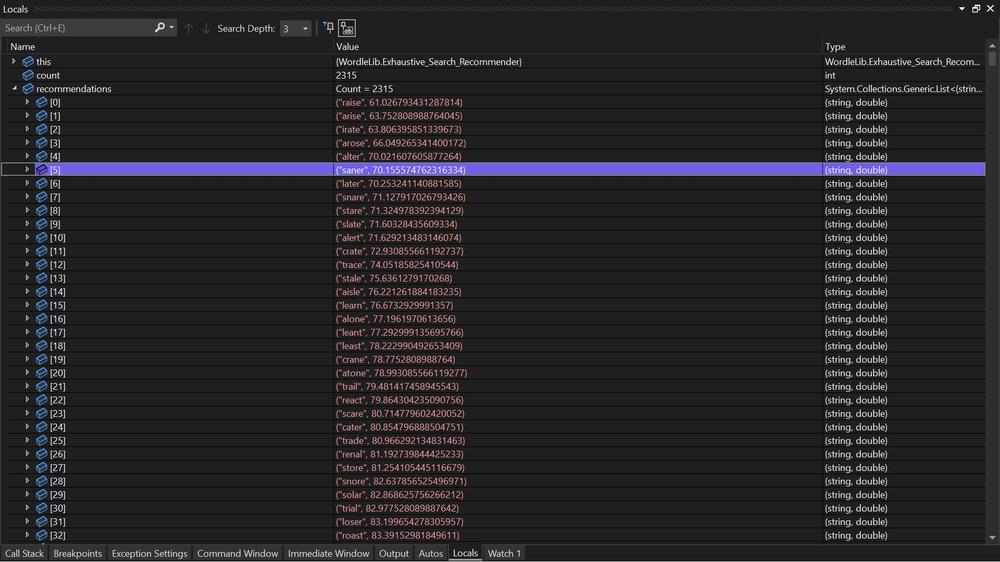

# Wordle Solver

## Wordle Solver in C# (Visual Studio 2022, .Net 6 LTS)

Wordle is a word puzzle game, and this command line program can (usually) solve it within 6 tries.

Example:

Performance of the recommender:

This program uses a list of Wordle answers, stored at: "/WordleLib/AnswerList.cs". This list must be up to date for the program to work correctly.

Best starting choices for Wordle:

